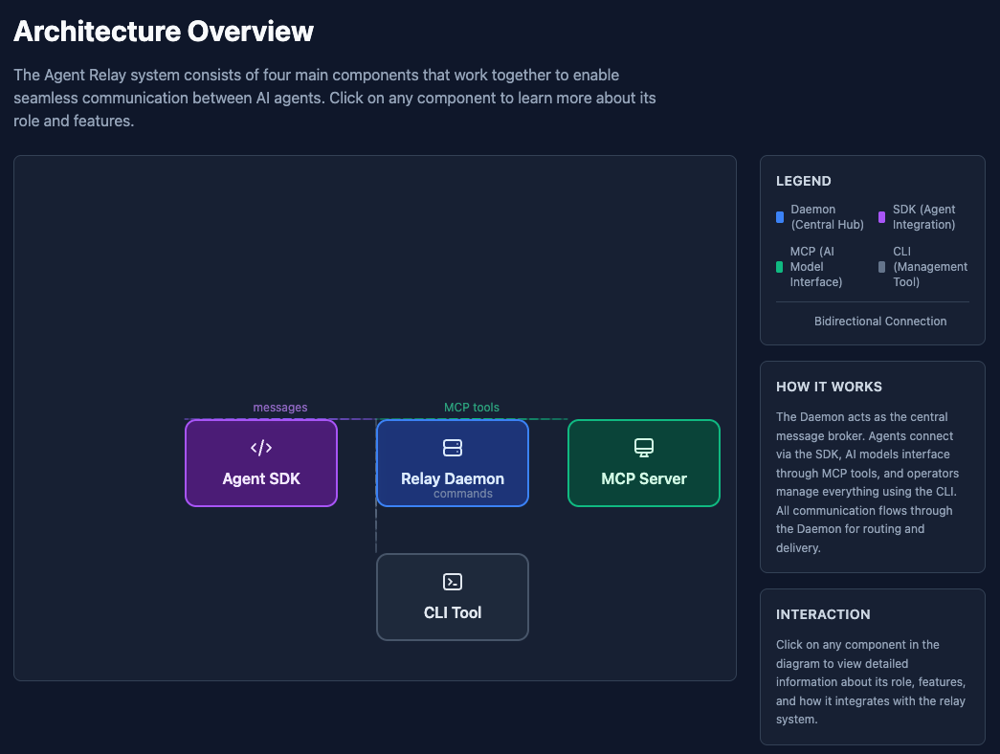

# Agent Relay Visualizer

A modern, interactive web application that visually explains and demonstrates how the Agent Relay system works. Built with React and TypeScript, it helps users understand the architecture, message flow, and usage patterns of a multi-agent communication system.



## Features

- **Interactive Architecture Diagram** - Explore the core components of Agent Relay with clickable nodes and animated connections
- **Message Flow Visualization** - Step-by-step animated visualization of how messages route between agents
- **Multi-Agent Demo** - Interactive simulation of multiple agents communicating in real-time
- **Code Examples** - Syntax-highlighted examples showing SDK usage patterns
- **Dashboard Integration** - Connect to live relay daemon for real-time monitoring
- **Responsive Design** - Works seamlessly on desktop and mobile devices
- **Accessible** - Keyboard navigation, ARIA labels, and screen reader support

## Tech Stack

- **React 18** with TypeScript
- **Vite** for fast development and builds
- **Tailwind CSS** for styling
- **Framer Motion** for animations
- **React Router** for navigation
- **Prism React Renderer** for code syntax highlighting

## Getting Started

### Prerequisites

- Node.js 18+
- npm or yarn

### Installation

```bash
# Clone the repository
git clone <repository-url>
cd relay-visualizer

# Install dependencies
npm install

# Start development server
npm run dev
```

The app will be available at `http://localhost:5173`.

### Production Build

```bash
# Build for production
npm run build

# Preview production build
npm run preview
```

## Available Scripts

| Script | Description |
|--------|-------------|
| `npm run dev` | Start development server |
| `npm run build` | Type-check and build for production |
| `npm run preview` | Preview production build locally |
| `npm run lint` | Run ESLint |
| `npm run type-check` | Run TypeScript type checking |
| `npm run test` | Run type-check and lint |

## Project Structure

```
relay-visualizer/
├── src/
│   ├── main.tsx              # React entry point
│   ├── App.tsx               # Main app with routing
│   ├── pages/                # Page components
│   │   ├── HomePage.tsx
│   │   ├── ArchitecturePage.tsx
│   │   ├── MessageFlowPage.tsx
│   │   ├── MultiAgentDemoPage.tsx
│   │   ├── CodeExamplesPage.tsx
│   │   └── DashboardPage.tsx
│   ├── components/
│   │   ├── layout/           # Navigation, Layout
│   │   ├── diagrams/         # ComponentNode, ConnectionLine, MessageBubble
│   │   ├── code/             # CodeBlock, CodeTabs
│   │   ├── simulation/       # Agent simulation components
│   │   └── animations/       # Animation utilities
│   ├── data/                 # Static data (code examples)
│   ├── hooks/                # Custom React hooks
│   └── styles/               # Global styles
├── public/                   # Static assets
├── index.html
├── package.json
├── tailwind.config.js
├── tsconfig.json
└── vite.config.ts
```

## Pages

### Home (`/`)
Landing page with project overview and navigation to all features.

### Architecture (`/architecture`)
Interactive diagram showing Agent Relay components:
- **Relay Daemon** - Central hub for agent communication
- **Agent SDK** - TypeScript/JavaScript SDK for integration
- **MCP Server** - Model Context Protocol support for AI
- **CLI** - Command-line interface tools

### Message Flow (`/message-flow`)
Animated visualization of message routing between agents through the relay daemon.

### Multi-Agent Demo (`/multi-agent`)
Interactive simulation with configurable agents, play/pause controls, and speed adjustment.

### Code Examples (`/code-examples`)
SDK usage examples including basic setup, real-time communication, and multi-agent patterns.

### Dashboard (`/dashboard`)
Integration with live relay daemon at `localhost:3888` for real-time monitoring.

## License

MIT
